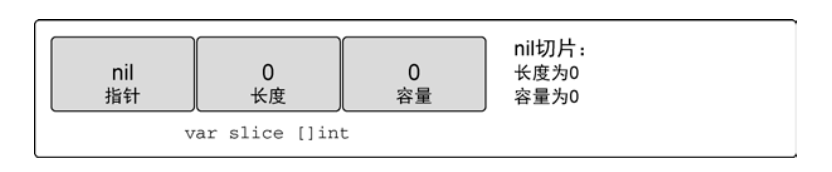

# 数组、切片和映射

## 4.1 数组的内部实现和基础功能
> 了解数据结构，一般会从数组开始，因为数组是切片和映射的基础数据结构。<br>
> 了解数组的工作原理，有助于理解切片和映射提供的功能。

### 4.1.1 内部实现

在Go语言里，数组是一个长度固定的数据类型，用于存储一段相同类型的元素的连续块。<br>

### 4.1.2 声明和初始化

```golang
var array [5]int
```

使用字面量声明数组
```golang
array := [5]int{10, 20, 30, 40, 50}
```

使用`...`代替数组长度，Go语言会根据初始化时数组元素的数量来确定该数组的长度。

```golang
array := [...]int{10, 20, 30, 40, 50}
```

声明数组并制定特定索引的元素的值
```golang
// 声明一个长度为5的数组
//并制定索引为1和2的元素的值
//其余元素保持零值
array := [5]int{1: 10, 2: 20}
```

### 4.1.3 使用数组

```golang
array := [5]int{10, 20, 30, 40, 50}
array[2] = 35 // 修改索引2的元素的值

// 声明一个包含5个元素的指向整数的数组
// 用整型指针初始化索引0和1的元素
array2 := [5]*int{0: new(int), 1:new(int)}
*array2[0] = 10
*array2[1] = 20

// 数组是一个值，这意味着数组可以用于赋值操作
var array3 [5]string
array4 := [5]string{"1", "2", "3", "4", "5"}
array3 = array4

// 数组变量的类型包含长度和元素类型，只有长度和数据类型都相同的数组才能相互赋值
var array5 [4]string

array5 = array4 // 编译报错 Compiler Error

// 将一个指针数组赋值给另一个
var array6 [3]*string
array7 := [3]*string{new(string), new(string), new(string)}
*array7[0] = "Red"
*array7[1] = "Blue"
*array7[2] = "Green"

array6 = array7

```

### 4.1.4 多维数组
> 数组本身只有一个维度，但是可以组合多个数组创建多维数组。<br>
> 多维数组很容易管理具有父子关系的数据或具有坐标系相关的数据。

```golang
// 声明一个二维整型数组，第一维存4个元素，第二维存2个元素
var array [4][2]int
// 使用数组字面量来声明并初始化一个二维整型数组
array2 := [4][2]int{{1, 11}, {2, 22}, {3, 33}, {4, 44}} 
// 访问二维数组的元素
var array3 [3][2]int
array3[0][0] = 1
array3[0][1] = 11
array3[1][0] = 2
array3[1][1] = 22
array3[2][0] = 3
array3[2][1] = 33

var array4 [3][2]int
// 和一维数组一样，只要类型一致，就可以将多维数组相互赋值
array4 = array3

var array5 [2]int = array4[0]

```

### 4.1.5 在函数间传递数组
> 就内存和性能而言，在函数间传递数组是一个开销很大的操作。<br>
> 在函数间传递变量时，如果以值的方式传递的的话，如果这个变量是个数组的话，意味着无论这个数组多大，都会完整复制，并传递给函数。

```golang
var array [1000000]int
...
// 将数组传递给函数foo
foo(array)

func foo(arr [1000000]int){
    ...
}
```

如上所示，每次函数foo被调用时，必须在栈上分配8MB的内存，之后整个数组的值（8MB的内存）被复制到刚分配的内存中去。<br>
虽然Go会自己处理这个复制操作，但是开销时不变的。<br>

还有一种更好切更高效的方式来处理这个操作。可以只传入指向数组的指针，只要只需要复制8字节的数据，而不是8MB的内存数据到栈上，如下所示：
```golang
var array [1000000]int
...
// 将数组的地址传递给函数foo
foo(&array)

func foo(arr *[1000000]int){
    ...
}
```
这样函数foo在被调用的时候接受一个指向100w个整型值的数组的指针。现在将数组的地址传入函数，只需要在栈上分配8字节的内存给指针即可。<br>
这个操作会更有效的利用内存，性能也更好。<br>
 
 `不过你要明白的是，因为现在传递的是指针，所以在函数内如果改变指针指向的值，会改变共享的内存。即引用传递。`

## 4.2 切片的内部实现和基础功能
> 切片也是一种数据结构，这种结构便于使用和管理数据集合。<br>
> 切片是围绕动态数组的概念来构建的，可以按需自动扩缩容。切片的动态扩容是通过内置函数`append`来实现的。 <br>
> 还可以通过对切片再次切片来缩小一个切片的大小，因为切片的底层内存也是在连续块中分配的，所以切片还能获得索引、迭代以及被垃圾回收优化的好处。

### 4.2.1 内部实现
> 切片是一个很小的对象，对底层数组进行了抽象,并提供了相关的操作方法。<br>
> 切片有3个字段的数据结构,分别是`指向底层数组的指针`、`切片元素的个数(即长度)`、`切片允许增长到的最大元素个数(即容量)`(如图4-9所示)
<div align=center>
    
    <div>图4-9</div>
</div>

### 4.2.2 创建和初始化切片
> 在Go中有几种方法可以创建和初始化切片；是否提前知晓切片需要的容量通常会决定切片创建的方式。

**1. make和切片字面量**
使用内置函数make来创建切片时，需要传入参数来制定切片的长度。
```golang
// 创建一个长度和容量都是5的字符串切片
slice := make([]string, 5)
// 创建一个长度为3，容量为5的字符串切片
slice2 := make([]string, 3, 5)
```
分别指定长度和容量时，创建的切片，底层数组的长度即指定的容量<br>
`不允许创建容量小于长度的切片。`

另外一种常用的创建切片的方式时使用切片字面量。
```golang
slice := []string{"Red", "Blue", "Green", "Yellow", "Pink"}
```

**2.nil和空切片**

只要在声明时不做任何初始化，就会创建一个nil切片
```golang
var slice []int
```

在Go中，nil切片时很常见的创建切片的方法。nil切片可以用于很多标准库和内置函数。在需要描述一个不存在的切片时，nil切片就合适；例如一个函数要求返回一个切片但是发生异常的时候。
<div align=center>
    
    <div>图4-10</div>
</div>

声明空切片
```golang
slice := make([]int, 0)
slice2 := []int{}
```
空切片底层数组包含0个元素，也没有分配任何存储空间。
<div align=center>
    
    <div>图4-11</div>
</div>

无论是nil切片还是空切片，对其调用内置函数`append`, `len`, `cap`的效果都是一样的。

### 4.2.3 使用切片

**1.赋值和切片**
```golang
slice := []int{10, 20, 30, 40, 50}
// 改变切片索引为3的元素的值
slice[3] = 9
```

切片之所以叫切片呢，是因为创建一个新的切片就是把底层数组切出一部分。
```golang
// 使用字面量创建一个容量和长度都是5的切片
slice := []int{10, 20, 30, 40, 50}

// 创建一个新切片
// 长度为2，容量为4，理由如图4-12所示
newSlice := slice[1:3]
```
在原切片之上切分新的切片之后，就有了两个切片，他们共享一个底层数组，但是通过不同的切片会看到底层数组不同的部分。
<div align=center>
    
    <div>图4-12</div>
</div>

第一个切片能看到底层数组全部的5个元素的容量，newSlice只能看到切片起始之后的2个元素，但是实际上容量为4。
```
如何计算新切片的长度和容量

对底层数组容量为k的切片slice [i:j]l来说
长度：j-i
容量：k-i
```
`值得注意的是，新老切片共享同一个底层数组，如果一个切片修改了该底层数组的共享部分，另一个切片也能感知到`

**2.切片增长**
> 相较于数组而言，使用切片的一个好处就是，可以按需增加切片的容量。<br>
> Go语言中的内置函数`append`会处理切片增长。

`函数append一定会增加新切片的长度，而容量却不一定，这却绝育被操作的切片的可用容量`
```golang
slice := []int{10, 20, 30, 40, 50}
newSlice := slice[1:3]
newSlice = append(newSlice, 35)
```
上述操作newSlice长度从2增长到3，容量不变<br>

由于slice和newSlice共用一个底层数组，切newSlice还有容量可用，所以上述append操作并没有创建新的底层数组，增长newSlice导致，slice索引为3的元素值也被改动了。如图4-13所示。
<div align=center>
    
    <div>图4-13</div>
</div>

如果切片的底层数组没有足够的容量，append函数会创建一个新的底层数组，将被引用的现在的值复制到新的底层数组中，再追加新的值。
[源码地址](https://github.com/golang/go/blob/release-branch.go1.21/src/runtime/slice.go#L157)

```golang
slice := []int{1, 2, 3, 4}
newSlice := append(slice, 5)
```
当这个append完成之后，newSlice拥有一个全新的底层数组，这个数组的容量是原来的两倍，如图4-14所示。
<div align=center>
    
    <div>图4-14</div>
</div>

内置函数append会智能的处理底层数组的容量增长，在切片容量小于1024个元素是，总是成倍的增加容量，当元素个数超过1024时，增长率变为25%，即每次增加25%的容量。

**3.创建切片时的3个索引**
> 在二次切片时，还可以使用第三个索引选项来控制新切片的容量。其目的不是要增加容量，而是要限制容量。
```golang
slice := []string{"Apple", "Orange", "Plum", "Banana", "Grape"}
// 从索引为2处开始切分，截止索引3（实际只切到了一个元素），容量从索引2到索引4，也就是容量为2
newSlice := slice[2:3:4]
```
这个切片执行完后，newSlice就成为了长度为1，容量为2的新切片，具体而言就是newSlice引用了`Plum`元素,并将容量扩展到`Banana`元素，如图4-15所示。
<div align=center>
    
    <div>图4-15</div>
</div>

```golang
对于slice[i:j:k]而言
容量：k-i
长度：j-i
```
如果想安全的增长新切片，而不改变老切片，比较好的做法是设置新切片的长度和容量一致
```golang
slice := []string{"Apple", "Orange", "Plum", "Banana", "Grape"}
newSlice := slice[2:3:3]
// 由于长度和容量一致，append开启新底层数组并复制元素到新底层数组中使用，这样就和slice使用了不一样的底层数组，后续修改也就不会影响到slice
newSlice = append(newSlice, "Kiwi")
```

内置函数append也是一个可变参数的函数，这意味着可以一次传递多个追加的值。<br>
如果使用`...`运算符，可以将一个切片的所有元素追加到另一个切片里。
```golang
s1 := []int{1, 2, 3}
s2 := []int{4, 5, 6}
newSlice = append(s1, s2...)
fmt.Printf("%v\n", newSlice)
// Output:
// [1 2 3 4 5 6]
```

**4.迭代切片**
> 既然切片是一个集合，那就可i迭代其中的元素。<br>
> Go语言有个关键字`range`，可以配合关键字`for`来迭代切片里面的元素。
```golang
slice := []int{10, 20, 30, 40, 50}
for index,value := range slice {
    fmt.Printf("Index: %d, Value: %d\n", index, value)
}
// Output
// Index: 0, Value: 10
// Index: 1, Value: 20
// Index: 2, Value: 30
// Index: 3, Value: 40
// Index: 4, Value: 50
```
迭代切片的时候，关键字range会返回两个值，第一个值是当前迭代到的索引位置，第二个值是该位置元素值的一个副本。<br>
`值得注意的是，range创建了每个元素的副本，而不是直接返回该元素的引用`
```golang
slice := []int{10, 20, 30, 40, 50}
for index, value := range slice {
    fmt.Printf("Index: %d, Value: %d，ValueAddr: %x, ItemAddr: %x \n", index, value, &value, &slice[index])
}
// Output
// Index: 0, Value: 10，ValueAddr: c0000a60a8, ItemAddr: c0000b40c0 
// Index: 1, Value: 20，ValueAddr: c0000a60a8, ItemAddr: c0000b40c8 
// Index: 2, Value: 30，ValueAddr: c0000a60a8, ItemAddr: c0000b40d0 
// Index: 3, Value: 40，ValueAddr: c0000a60a8, ItemAddr: c0000b40d8 
// Index: 4, Value: 50，ValueAddr: c0000a60a8, ItemAddr: c0000b40e0 
```
可以看到，迭代返回的变量是一个迭代过程中根据迭代位置一次赋值的新变量，所以value的地址总是相同的。<br>
`要想获取每个元素的地址，可以使用切片变量和索引值:&slice[index]`

如果不需要索引值或者value，可以使用`空白标识符`(下划线`_`)来忽略这个值。

关键字`range`总是会从头部开始迭代。如果想对迭代做更多的控制，可以使用传统的`for`循环,如下所示。
```golang
slice := []int{10, 20, 30, 40, 50}
for index := 2; index < len(slice); index++ {
    fmt.Printf("Index: %d, Value: %d\n", index, slice[index])
}
// Output
// Index: 2, Value: 30
// Index: 3, Value: 40
// Index: 4, Value: 50
```

有两个特殊的内置函数`len`和`cap`,可以用于处理数组、切片和通道；对于切片，函数len返回切片的长度，cap返回切片的容量。

### 4.2.4 多维切片
> 和数组一样，切片是一维的；不过和数组一样也可以组合多个切片形成多维切片。
```golang
slice := [][]int{{10}, {100, 200}}
```
上述切片最终的内存模式，如下图4-16所示
<div align=center>
    
    <div>图4-16</div>
</div>
append函数也可以用于多维切片上.

```golang
slice := [][]int{{10}, {100, 200}}
// 先增长切片，再将新切片赋值给外层切片的第一额元素。
slice[0] = append(slice[0], 20)
```

### 4.2.5 在函数间传递切片
> 在函数间传递切片就是要在函数间以值的方式传递切片。<br>
> 由于切片的底层数据存储是引用数组，所以函数间复制和传递切片的成本很低。<br>
> 但是也意味着函数内对切片的改变，会作用于原始的切片底层数组之上，导致原切片元素值也会被改变。

在64位的机器上，一个切片需要24字节的内存,`指针`、`长度`、`容量`各需要8字节。<br>
由于切片的数据存储在引用的底层数组里，不属于切片本身，所以复制切片到人意函数的时候，都不会复制底层数组，只会复制切片本身。如下图4-17所示。
<div align=center>
    
    <div>图4-17</div>
</div>

值得注意的是，虽然切片本身是24字节的值传递，但是底层数组属于切片指针字段`array`所指向，值传递所复制的切片的`array`字段，本身是拷贝的指针，对这个指针解引用之后，指针指向的具体地址是一样的。
```golang
// https://github.com/golang/go/blob/release-branch.go1.21/src/runtime/slice.go
type slice struct {
	array unsafe.Pointer
	len   int
	cap   int
}
```
- 由于append的特性，如果append发生了扩容操作，那么形参的底层数组发生了变化后对切片的操作不会影响到实参。<br>
- 如果函数内的操作没产生扩容操作，并且对切片append了元素，虽然形参和实参的底层数组依然一致，但是实参的长度并没有发生改变，所以实参是看不到append的元素的。<br>
- 如果函数内操作形参改变了实参长度内的元素，那么实参元素也会收到改变。

## 4.3 映射的内部实现和基础功能
> 映射是一种数据结构，用于存储一系列无序的键值对。<br>
> 映射基于键来存储值。映射能够基于键快速检索数据，键就像是索引一样指向与该键关联的值。

### 4.3.1 内部实现
> 映射是一个集合，可以使用类似处理数组和切片的方式去迭代映射中的元素；但映射是无序集合，即便使用同样顺序保存键值对，每次迭代映射的顺序也可能不一样。<br>
> 无序的原因是映射使用了`散列表`,如图4-18所示。
<div align=center>
    
    <div>图4-18</div>
</div>

映射的散列表包含一组桶。 <br>
在存储、删除或查询键值对时，所有操作都要先选择一个目标桶；把操作映射时给丁的键传给映射的`散列函数`,就能选定对应的桶；这个散列函数的目的就是生成一个索引，这个索引最终能将键值对分布到所有可用的桶里面去。

- `每个桶最多存储8个元素`
    - 由hamp最终存储元素的bucket([bmap](https://github.com/golang/go/blob/release-branch.go1.21/src/runtime/map.go#L151))决定 
    - bmap在编译时候编译器会给它动态创建一个新的结构 - [源码地址](https://github.com/golang/go/blob/release-branch.go1.21/src/cmd/compile/internal/reflectdata/reflect.go#L97)
    - [MapBucketCount](https://github.com/golang/go/blob/release-branch.go1.21/src/internal/abi/map.go#L11)在`go1.21`的设定是8
- `散列函数计算的hash值的高8位，决定key落于桶内那个位置`
- `hash值散列键，低位选桶，高位选桶内位置`

### 4.3.2 创建和初始化
> Go语言中有很多种方法可以创建并初始化映射，可以使用内置函数`make`，也可以使用映射字面量。
```golang
dict := make(map[string]int)

dict2 := map[string]string{"Red": "#da1337","Orange": "#e95a22"}
```

映射的key可以是任何值，这个值的类型可以是内置的类型，也可以是结构类型，只要这个值可以使用`==`运算符做比较。切片、函数以及包含切片的具有引用语义的类型就不能作为映射的key，会造成变异错误。

### 4.3.3 使用映射
> 键值对赋值给映射，是通过指定适当类型的key并给这个key赋一个value来完成的。
```golang
colors := map[string]string{}
colors["Red"] = "#da1337"
```
可以通过声明一个未初始化的映射来创建一个值为nil的映射；nil映射不能用于存储。
```golang
var colors map[string]string
colors["Red"] = "#da1337"

// Runtime Error:
// panic: runtime error: assignment to entry in nil map
```

**判断key是否存在**
```golang
value, exists := colors["Blue"]
if exists {
    fmt.Println(value)
}
```

在Go语言里，通过key来索引映射时，即便这个key不存在，也会返回一个映射值类型的零值。
如果确定value不可能为零值的话，也可直接通过判断value是否零值来确定key是否存在。

**迭代映射 && 删除映射项**

迭代映射和迭代切片类似，使用关键字`range`,不同的是，range返回的不是索引和值，而是键和值。
```golang
colors := map[string]string{
    "AliceBlue": "#f0f8ff",
    "Coral": "#ff7F50",
    "DarGray": "#a9a9a9",
    "ForestGreen": "#228b22",
}
for key, value := range colors {
    fmt.Printf("Key: %s Value: %s\n", key, value)
}
// 删除映射项
delete(colors, "Coral")
```

### 4.3.4 在函数间传递映射
> 在函数间传递映射并不会制造出该映射的副本

[code](../code/unit/chapter3/map.go)


## 4.4
- 数组是构造切片和映射的基石
- Go语言中常用切片来处理数据的集合，用映射来处理键值对结构的数据
- 内置函数`make` 可以用来创建切片或映射，并指定原始的长度和容量；也可以直接使用切片和映射的字面量创建。
- 切片有容量限制，有扩缩容机制。
- 映射的增长没有容量或者任何限制
- 内置函数`len`可以用来获取切片或映射的长度
- 内置函数`cap`可以用户获取切片的容量
- 通过组合，可以创建多维数组和多维切片，也可以使用切片或者其他映射作为映射的值，但是切片不能用作映射的键
- 切片和映射的传递成本很小，不会复制底层的实际数据结构


